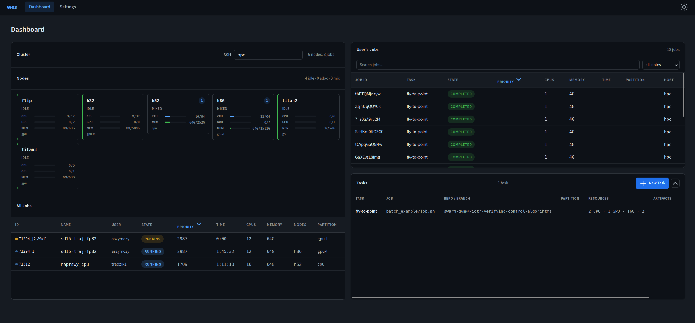

# WES - WUT Experiment Scheduler

WES is set of helper tools for scheduling and observing jobs on slurm from remote machine.



## Todo:

[x] WES cli - tool for launching jobs
[x] WES web - tool for cluster utilization and job monitoring
[ ] WES sync - tool for syncing files with cluster
[ ] WES web faster file sync (current files are syncing but it takes a lot of time)

## Install

```bash
pip install -e ".[dev]"
```

or
```bash
uv sync
```

## Run

Run web interface: 

```bash
wes serve               # web interface at http://127.0.0.1:8000
```

Command line option:

```bash
wes launch task.wes     # run tasks from a config
wes sync --ssh hpc      # continuously sync job status
```

Or via Makefile: `make run`, `make serve`, `make test`, `make check`.

## WES tasks

A `.wes` file is YAML. Each task clones a repo and runs a job:

```yaml
sequence:
  - my_task:
      git_url: ssh://git@host/user/repo.git
      branch: main
      ssh: hpc
      pre: scripts/pre.sh
      job: scripts/job.sh
      artifacts:
        - results
      cpus: "4"
      gpus: "1"
      memory: 16G
```

See `task.wes` for a working example.

Optional git credentials go in a `.env` file (see `.env.example`).
